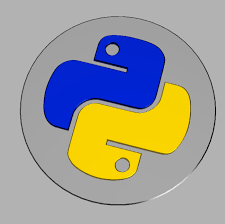

 
  

<h1 align="center"> Block 1. Data Analysis </h1>
<h3 align="center"> Fundamental skills for data analysis. Topics covered Python,SQL, NumPy and Pandas libraries, handling various data sources, API, web scrapping, creating effective visualizations using Seaborn and Matplotlib libraries and applying statistical techniques to obtain meaningful insights and make data-driven decisions. </h3>  

 

 
  

<!-- TABLE OF CONTENTS -->
<h2 id="table-of-contents">Table of Contents</h2>

  
Table of Contents

  <ol>
    <li><a href="#about-Block-1-Data-Analysis"> ➤ About Block 1 Data Analysis</a></li>
    <li><a href="#prerequisites"> ➤ Prerequisites</a></li>
    <li><a href="#folder-structure"> ➤ Folder Structure</a></li>
    

<!-- ABOUT THE PROJECT -->
<h2 id="about-Block-1-Data-Analysis"> About Block 1 Data Analysis</h2>

 
  This block aims to  teach the fundamental skills for data analysis. The course covers a wide range of topics, including Python core skills, SQL, NumPy and Pandas libraries, handling various data sources, API, web scraping, creating effective visualizations using Seaborn and Matplotlib libraries, and applying statistical techniques to obtain meaningful insights and make data-driven decisions. 

 More specifically, this course include an introduction to statistics, then it shows how to define single and multi-dimensional NumPy arrays, perform mathematical operations in NumPy, perform arrays slicing and indexing, understanding pandas, visualization, and reporting through hands-on projects.
 
The course provides an excellent learning tool for creating strategies and correct business decisions from the data at hand. It also includes data ingestion, data preparation, data wrangling, and data aggregation 

 
  

<!-- PREREQUISITES -->
<h2 id="prerequisites"> Prerequisites</h2>

  
  

<!--This project is written in Python programming language.  -->
The following open source packages are used in this course:
* Numpy 
* Pandas 
* Matplotlib 
* Scikit-Learn 
* Seaborn 

<!-- :paw_prints:-->
<!-- FOLDER STRUCTURE -->
<h2 id="folder-structure"> Folder Structure</h2>

 
  

   
